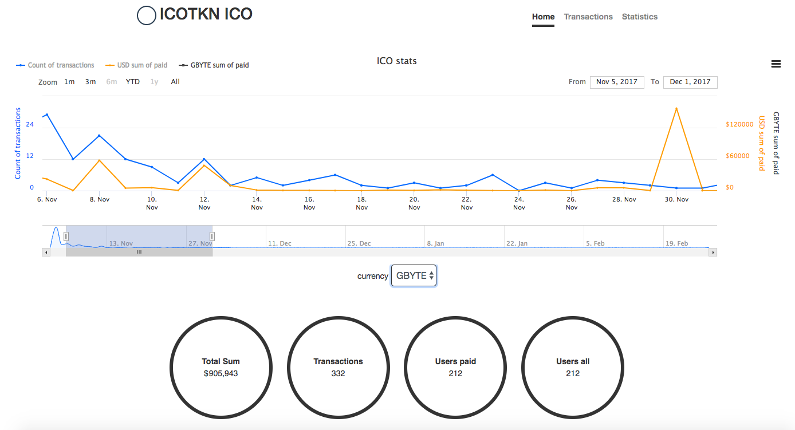

# ICO Bot with Web server

This bot allows to run an ICO on Byteball network.  It accepts Bytes, BTC, and Ether from users and sends back the new tokens in exchange.  You set the prices relative to USD or other fiat or crypto currencies. 

## Install

Install node.js, clone the repository, then say
```sh
npm install
```

## Run

### Before the ICO

First, you need to sync your node
```sh
node sync.js 2>errlog
```
It will take about 3 days on SSD.

The bot is based on [headless wallet](../../../headless-obyte), see its documentation too to understand what options you have.  Also see the documentation of [the core library](../../../ocore).  Note that the default config enables TOR for security reasons, you need to have a TOR service running on your machine or disable TOR in conf.

Edit `conf.js` or `conf.json` to describe the properties of your token and token sale.  See the comments in `conf.js` which describe the options.  Some of the most important options:

* `bRequireRealName`: to require KYC.
* `bRequireNonUs`: to allow only non-US investors.
* `bRequireAccredited`: to allow only accredited investors.
* `rulesOfDistributionOfTokens`: `real-time` for sending tokens immediately after the payment is confirmed, `one-time` for collecting investments during the ICO, and then sending tokens to all investors in one go when the ICO is over.
* `totalTokens`: total number of smallest indivisible units (pennies) of the newly issued token.
* `tokenDisplayDecimals`: number of decimals in user-displayed amounts of the token.  Total supply in user-displayed units is `totalTokens / 10^tokenDisplayDecimals`.
* `assocPrices`: prices of your token depending on the payment currency.  The prices can be pegged to another currency, such as USD, in this case the prices in payment currency are periodically updated using exchange feeds.  Note that the prices are per smallest indivisible unit of your token, they are different from prices per user-displayed token by `tokenDisplayDecimals` decimal places.
* `startDate` and `endDate`: start and end dates of the crowdsale.
* `accumulationAddresses`: all collected funds are periodically swept to these addresses (one address per currency), it is recommended that these addresses are better secured by being multisig or offline.
* `arrAdminAddresses`: array of device addresses of admins.  Only admins can change the price of your token by giving commands to the bot in chat interface (see below).  If you don't want to change the price via chat, leave this field empty.
* `socksHost` and `socksPort`: configure your bot to use TOR, so rest of the network won't know your real IP. Also, configure Cloudflare to access the real IP, HTTPS and caching.

Chat with the bot, learn its address and pay a small amount (at least 10000 bytes) to fund asset issuance.  You’ll see the balance only when it is fully synced.

When it is synced, cd to `scripts` and run
```sh
node issue_tokens.js
```
Don't kill the script too early and follow its output.  It first creates a definition of the new token, waits for confirmation, then actually issues it.

### Start the ICO

When issuance is done, run
```sh
node ico.js 2>errlog
```
Thereafter, you start the daemon only with ico.js.  Now, the bot is ready to accept payments.

If you want to change the price of your token, you have two options:
* ssh to your server and edit conf.json.  Note that the price stored in conf.json is the price per smallest indivisible unit of your token, which is `tokenDisplayDecimals` decimal places different from the price displayed to the users.  After editing the conf, restart your bot for the changes to take effect.
* if you enabled `arrAdminAddresses` in your conf (see above), any of the admins can chat with the bot and change the price by sending `set price <new price>` command to the bot (type `admin` to be reminded about the format of the command).  The price is per user-displayed token.  Any changes are effective immediately without restart.  This command edits your conf.json, so the new price is remembered even if the bot is restarted.

### After the ICO

Cd to `scripts`.  Burn the remaining tokens:
```sh
node burn_remaining_tokens.js
```
If you failed to reach your target, refund:
```sh
node refund.js
```
If you chose one-time distribution (rather than sending tokens back to users immediately after receiving the payment), run the distribution script:
```sh
node run_one_time_distribution.js
```

## Bitcoin

### Install

Install Bitcoin Core https://bitcoin.org/en/full-node#linux-instructions

To save space, it is recommended to run it in pruning mode.  Edit your `~/.bitcoin/bitcoin.conf` and add the line `prune=550`.  The Bitcoin node will take only 5Gb disk space.

Set `rpcuser` and `rpcpassword` in your `bitcoin.conf` the same as in the conf (`conf.js` or `conf.json`) of this bot.

### Start
```
bitcoind -daemon
```

## Ethereum

### Install
Install [geth](https://github.com/ethereum/go-ethereum/wiki/Installing-Geth#install-on-ubuntu-via-ppas)

### Start
Start dev node
```bash
$ geth --dev --mine --minerthreads 1 --ws --wsorigins "*" --wsapi "db,eth,net,web3,personal,miner"
```

Start Ropsten test network node
```bash
$ geth --testnet --ws --wsorigins "*" --wsapi "admin,db,eth,net,web3,personal" --cache=1024 --syncmode light
```

Start Main network node
```bash
$ geth --ws --wsorigins "*" --wsapi "admin,db,eth,net,web3,personal" --cache=1024 --syncmode light
```

# Web server

A web server that shows stats of the ongoing ICO is started automatically when you start `ico.js`.  The server listens on port 8080 by default.  You usually want to proxy the web traffic to the server via nginx.

You can also start the server separately of `ico.js`:
```
node server/bin/www.js
```

## Environment

### Back End
* [node.js](https://nodejs.org/en/) (v8.x.x)
* [sqlite](https://www.postgresql.org/) (v3.x.x)
* [pm2](http://pm2.keymetrics.io/)

### Front End
* [bower](https://bower.io/)
* [jquery](http://api.jquery.com/) (v3.x.x)
* [bootstrap](https://getbootstrap.com/docs/4.0/) (v4.x.x)
* [pug](https://pugjs.org)
* [stylus](http://stylus-lang.com/)

## Client Build

Please run one of these commands before starting the web server and after each update.

* build (production)
```sh
npm run build
```
* build and start listening changes (production)
```sh
npm run builder
```
* build (development)
```sh
npm run build-dev
```
* build and start listening changes (development)
```sh
npm run builder-dev
```

## Server Start

`NODE_ENV` - `production` or `development` (`development`)

# Server API

Use these endpoints if you want to display ICO data on another website or want to fetch the data from another server.

## List of transactions

**URL** : `/api/transactions`

**Method** : `GET`

**Query parameters** :

 * `page=[integer]`  
 min=1  
 default=1
 * `limit=[integer]`  
 min=1, max=100  
 default=10
 * `sort=[string]`  
 one of ['currency_amount', 'creation_date']  
 default='creation_date'
 * `filter_stable=[string]`  
 one of ['all', 'true', 'false']  
 default='all'
 * `filter_currency=[string]`  
 one of ['all', 'GBYTE', 'BTC', 'ETH', 'USDT']  
 default='all'  
 * `filter_bb_address=[string]`  
 * `filter_receiving_address=[string]`  
 * `filter_txid=[string]`  

**Response** :

```
{ 
  "rows": [{
    "txid": [string],
    "receiving_address": [string],
    "byteball_address": [string],
    "currency": [string],
    "currency_amount": [decimal],
    "usd_amount": [decimal],
    "tokens": [integer],
    "stable": [integer],
    "creation_date": [string]
  }, ...],
  "total": [integer]
}
```

## Statistic

**URL** : `/api/statistic`

**Method** : `GET`

**Query parameters** :

 * `filter_currency=[string]`  
 one of ['all', 'GBYTE', 'BTC', 'ETH', 'USDT']  
 default='all'  
 * `filter_date_from=[string]`
 * `filter_date_to=[string]`

**Response** :

```
{
  "rows": [{
    "date": [string], 
    "count": [integer],
    "sum": [decimal],
    "usd_sum": [decimal]
  }, ...]
}
```

## Common data

**URL** : `/api/common`

**Method** : `GET`

**Query parameters** : -

**Response** :

```
{
  "count_transactions": [integer],
  "users_all": [integer],
  "users_paid": [integer],
  "total_sum": [decimal]
}
```

## Init data

**URL** : `/api/init`

**Method** : `GET`

**Query parameters** : -

**Response** :

```
{
  "tokenName": [string]
}
```